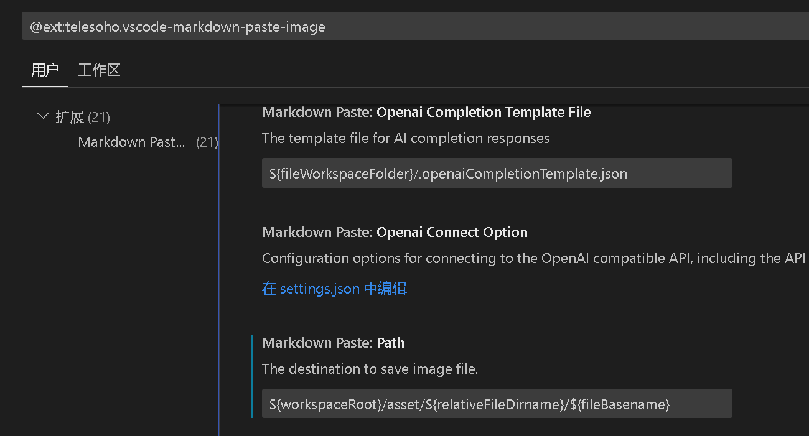
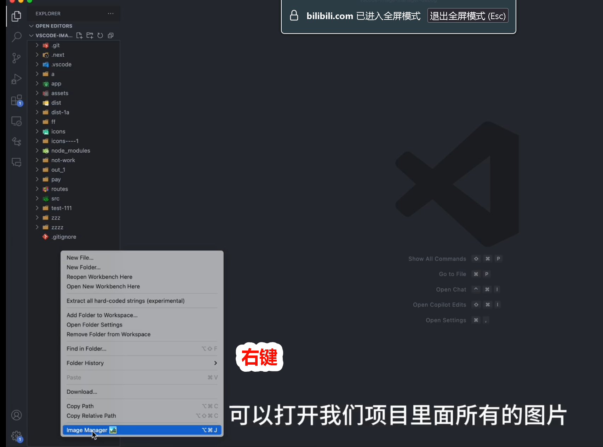

# IsItReal

学习笔记。

启动方式 …… Vue项目启动基本看 `package.json` 的配置.


## 题目模板

vitepress 自带的快速标记

```
::: details
:::
::: tip
:::
::: danger 请注意
:::
```

更全：

```
::: tip 提示
这是一段提示信息
:::

::: warning 注意
这是警告
:::

::: danger 危险
这是危险提示
:::

::: info 说明
这是普通说明
:::

::: details 点击展开
折叠的详细内容
:::
```


## 安装包

### 快速样式

- 快速样式：`npm install -D markdown-it-mark markdown-it-attrs`

然后在 `.vitepress/config.ts` 里

```js
import markdownItMark from 'markdown-it-mark'
import markdownItAttrs from 'markdown-it-attrs'

export default withMermaid({
  markdown: {
    config: (md) => {
      md.use(markdownItMark)
      md.use(markdownItAttrs)
    },
  },
})
```

`markdown-it-mark` 常见用法： 
- `==高亮==`
- `++下划线++`
- `~下标~`
- `^上标^`

`markdown-it-attrs` 常见用法： 

```vitepress
// 给标题加 id(方便锚点跳转,但 VitePress 标题默认已经自动生成 id 了,这个用处不大)
## 我的标题 {#custom-id}
// 给图片加宽高/样式
{width=300px}
{.rounded-shadow width=400px}
这是一段说明文字。{.small-gray}
// 还可以给代码块上样式
\```js {.my-code-style}
console.log('hello')
\```
```

行内的 {.class} 语法必须紧跟在一个"内联元素"后面(比如 **加粗**、`代码`、[链接]() 这些),不能直接加在一段普通文字后面


### 画图工具

- mermaid画图工具：`npm install -D mermaid vitepress-plugin-mermaid`

然后在 `.vitepress/config.ts` 里

```js
import { withMermaid } from 'vitepress-plugin-mermaid'

export default withMermaid({
  mermaid: {
    // 可选：mermaid 自身的配置，比如主题
  },
  mermaidPlugin: {
    class: 'mermaid my-class', // 给渲染出来的容器加 class，方便自定义样式
  },
})
```

注意：withMermaid 返回的类型和 defineConfig 不完全一致（TS 报错的话用 defineConfigWithTheme 或者直接 // @ts-ignore 也行,不影响构建）。

## 图片管理

安装插件：Paste Image(mushan.vscode-paste-image)，Image Manager

1. 路径自定义 + 自动建目录(这部分很成熟)
  `Paste Image` 插件就能做到！

  打开settings.json
  ```json
  {
    "MarkdownPaste.path": "${workspaceRoot}/asset/${relativeFileDirname}/${fileBasename}",
  }
  ```

  这样粘贴图片时,会自动在 `docs/assets/文章名/` 下建目录存图,文件夹不存在会自动创建。
  Paste Image 插件配置项中，Path设置图片存放的路径，用`${projectRoot}/assets/${currentFileDir}/{currentFileNameWithoutExt}` 含义是当前文件夹/assets/无后缀名的当前文件名。

  使用快捷键 `Ctrl+Alt+V` 即可将图片存放到相应路径的文件夹中，文件夹不存在会自动创建。

  

2. 重命名同步 + 孤立图片清理

  这两个功能更接近"资源管理器"性质，推荐 Image Manager。它专门做这件事：
  - 可视化管理项目里所有图片(网格预览)
  - 改文件名会自动同步更新所有引用它的 md/代码文件中的路径
  - 能检测"未被任何文件引用"的孤立图片,手动或批量清理
  - 支持压缩、格式转换等附加功能

  


