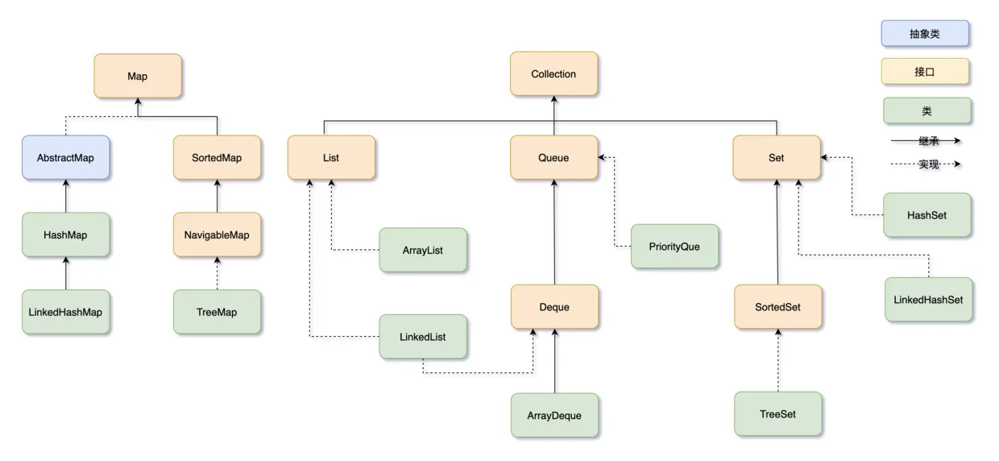

# 常用工具与语法块（java版）

## 排序的使用

### 重载排序函数

认识二维函数与 `Comparator`

```java
int[][] edges = { {3, 4}, {1, 2}, {2, 5} };
// 三种参考写法
Arrays.sort(edges, (a, b) -> a[0] - b[0]);
Arrays.sort(edges, (a, b) -> Integer.compare(a[0], b[0]));
Arrays.sort(edges, Comparator.comparingInt(a -> a[0]));
```

如果 `a[0] - b[0]` 返回0就继续比较呢？似乎不够满足更多的要求。

1. Lambda 手动判断
    
    Java 是强类型静态语言，一切表达式都必须有明确的类型。箭头函数本身没有类型，它只能出现在函数式接口（只有一个抽象方法的接口） 的上下文里，由编译器推断目标类型。箭头函数在JavaScript很多，因为随时创建没有模子的对象，这是两种语言很深刻的区别。
    :::details
    ```java
    Arrays.sort(edges, (a, b) -> {
        if (a[0] != b[0]) {
            return Integer.compare(a[0], b[0]);   // 先按第一个元素
        } else {
            return Integer.compare(a[1], b[1]);   // 第一个相同，按第二个元素
        }
    });
    ```
    :::

2.  Comparator.comparingInt 链式调用
    :::details
    ```java
    Arrays.sort(edges, Comparator.comparingInt((int[] a) -> a[0])
                .thenComparingInt(a -> a[1]));
    ```
    :::

3. Java 8 之前匿名内部类
    
    看起来很诡异，但其实写的最明白，直接传入一个比较的对象来给标准对象用，C++的STL也是可以用和这个方式重载的
    :::details
    ```java
    Arrays.sort(edges, new Comparator<int[]>() {
        public int compare(int[] a, int[] b) {
            if (a[0] != b[0]) return a[0] - b[0];
            else return a[1] - b[1];
        }
    });
    ```
    :::

### 索引重排

有的时候原数组是乱的，但是我们被强制要输出原索引，这个时候排序就不能直接修改原数组了。
主要有几种方法：

1. 值作为索引比较其他数组
    :::details
    ```java
    int[] idx_rearrange(int[] nums){
        // 1. 创建一个存放索引的 Integer 数组
        int[] idx = new int[nums.length];
        for (int i = 0; i < nums.length; i++) idx[i] = i;
        
        // 2. 按 nums 中的值对索引进行排序
        Arrays.sort(idx, (a, b) -> Integer.compare(nums[a], nums[b]));

        return idx;
    }
    ```
    :::

2. 类似第一种但写成2维数组，并且只对其中一个维度排序
    :::details
    ```java
    int[] idx_rearrange(int[] nums){
        // 1. 构建二维数组，第二维存 [数值, 索引]
        int[][] pair = new int[nums.length][2];
        for (int i = 0; i < nums.length; i++) {
            pair[i][0] = nums[i];  // 数值
            pair[i][1] = i;        // 原始索引
        }
        // 2. 按数值升序排序（如果数值相同，可以再按索引排，保证稳定性）
        Arrays.sort(pair, (a, b) -> {
            if (a[0] != b[0]) return Integer.compare(a[0], b[0]);
            return Integer.compare(a[1], b[1]);
        });
    }
    ```
    :::

3. 使用 record 特性
    
    record是一种特殊类，专为不可变数据载体设计，并且只能这么写。
    :::details
    ```java
    // 定义 Record（或 class）
    record Node(int value, int index) {}
    int[] idx_rearrange(int[] nums){
        Node[] nodes = new Node[nums.length];
        for (int i = 0; i < nums.length; i++) {
            nodes[i] = new Node(nums[i], i);
        }
        Arrays.sort(nodes, (a, b) -> Integer.compare(a.value(), b.value()));
    }
    ```
    :::

### Integer 比较坑点

**-128 到 127 范围内的值会复用同一个 Integer 对象，所以在这个区间内 ==/!= 碰巧能得出"看起来正确"的结果**{.color-red}；但一旦超出这个范围（你贴的这批数据基本都是几万到几十万级别，远超 127），每次装箱都会 new 一个新的 Integer 对象，即使数值相同，引用也不同，!= 就会被误判为"不相等"。

:::tip
一般建议：能用 `int[][]` 就不要用 `Integer[][]`；
如果因为要放进泛型容器（比如 `List<int[]`> 本身没问题，但 `List<List<Integer>>` 就绕不开装箱）必须用包装类型，
就**老老实实用 `.equals()` 或 `Objects.equals()`，别依赖 `==`**{.color-red}。
:::

## 集合框架

主要是在`new`的时候看，选择用什么、以及为什么。
很简单的一点就是：`new`类而不是`new`接口



## 数组操作

### 数组初始化

以下写法推荐且可行
1. 静态初始化
    :::details
    `int[][] edges = { {0,1},{0,2},{1,2},{3,4} };`
    :::

2. 分开写
    :::details
    ```java
    int[][] edges;
    edges = new int[][]{ {0,1},{0,2},{1,2},{3,4} };
    ```
    :::
   
3. 作为方法参数传入
    :::details
    ```java
    process(new int[][]{ {0,1},{0,2}});
    ```
    :::

4. 作为返回值返回
    :::details
    ```java
    public int[][] getEdges() {
        return new int[][]{ {0,1},{0,2} };
    }
    ```
    :::

5. 为了你的生命安全，请不要尝试：
    :::danger
    ```java
    int[][] edges;          // 先声明
    edges = { {0,1},{0,2},{1,2},{3,4} };  // ❌ 报错！这里不能直接用静态初始化器

    // 假设有个方法：void process(int[][] arr) { ... }
    process({ {0,1},{0,2} });  // ❌ 报错！语法不支持

    public int[][] getEdges() {
        return { {0,1},{0,2} };  // ❌ 报错
    }

    int[][] edges = new int[4][2] { {0,1},{0,2},{1,2},{3,4}};  // ❌ 报错（不要加上面的 [4][2]）
    ```
    :::

### new后初始化

基本类型自动被填充，包装器就多一步 `Arrays.fill`。

```java
boolean[] vis = new boolean[nums.length];  // 所有元素初始为 false

Boolean[] vis = new Boolean[nums.length];
Arrays.fill(vis, Boolean.FALSE);   // 全部设为 false
// 或 Arrays.fill(vis, true);      // 自动装箱为 Boolean.TRUE
```

这里一般涉及到更优雅的for写法。但这种写法仅限于修改对象的内部的数值，**因为for 的变量本质上是一个独立的变量，而不是一个C++的引用**{.color-red}。
如果你非要“重新赋值”数组元素，只能用索引写法。

```java
List<Integer>[] possibilities = new List[source.length()];   // ① 创建数组，所有元素为 null
for (List<Integer> ls : possibilities) {                     // ② 遍历数组
ls = new ArrayList<>();                                  // ❌  ③ 仅仅把局部变量 ls 指向了新对象，数组里的元素纹丝不动
}

int[] arr = {1, 2, 3};
for (int x : arr) {
    x = 5; // ❌ 基本类型传递的是值的副本，改副本对原数组毫无影响，所以这里只是把副本改成了 5，arr 依然是 [1, 2, 3]
}
```

应该改成：

```java
for (int i = 0; i < possibilities.length; i++) {
    possibilities[i] = new ArrayList<>();
}
Arrays.setAll(possibilities, i -> new ArrayList<>());
```

但是多重嵌套的集合并不好直接用索引操作：
```java
List<List<Integer>> ret = new ArrayList<>(n);   // size = 0，只是 capacity = n
for (int i = 0; i < n; i++) {
    ret.set(i, new ArrayList<>(m));             // ❌ i 超出边界，因为 size 还是 0
}
```

而是应当尊重集合的添加与删除规则进行操作：
```java
List<List<Integer>> ret = new ArrayList<>(n);
for (int i = 0; i < n; i++) {
    ret.add(new ArrayList<>(m));   // ✅ add 会动态扩展 size
}
// 先填充占位（不推荐，但可工作）
List<List<Integer>> ret = new ArrayList<>(Collections.nCopies(n, null));
for (int i = 0; i < n; i++) {
    ret.set(i, new ArrayList<>(m));
}

// 使用 Stream 生成（Java 8+）
List<List<Integer>> ret = IntStream.range(0, n)
    .mapToObj(i -> new ArrayList<Integer>(m))
    .collect(Collectors.toList());
```

## 字符串操作
### 新字符串的构造
java的字符串是无法被直接编辑的 —— 比C++麻烦很多。
我们只能使用 `StringBuilder` 进行编辑，但是编辑的时候有需要注意的点：
1. StringBuilder只支持append操作，如果直接在 idx 插入的话，复杂度是$O(n^2)$，所以如果倒序构造字符串推荐最后使用 `sb.reverse().toString()`
2. 如果直接模仿C++编辑单个字符的话，在 `sb.toString()` 的时候不会自动消除掉这些空格，未填充的地方会显示 `\u0000` 的 unicode 码


## 模拟STL

### 立即释放的参数

主要是写leetcode的时候，leetcode不需要写完整IO代码，但本地需要调试的时候又需要补上。
直接传入内容

```java
main.minCost("hello","world",Arrays.asList(
        Arrays.asList("he", "wo"),Arrays.asList("llo", "rld")
    ),new int[]{3,4});
```

List.of 是不可变的。Arrays.asList 是产生数组的方式


### 模拟stack

栈方法：push(e), pop(), peek()
类：ArrayDeque, LinkedList, Dequeue 都可以

```java
Deque<Integer> stack = new ArrayDeque<>();
//  递增栈
for(int i=0;i<nums.length;i++){
    while(!stack.isEmpty() &&  nums[i] >= stack.peek() ){
        stack.pop();
    }
    stack.push(nums[i]);
    ret[i] = Math.max(ret[i],stack.getLast());
}
```

### 去重 `std::unique` 

使用 `Stream.distinct()` —— stream 系列操作符

```java
List<Integer> numbers = Arrays.asList(1, 2, 2, 3, 4, 4, 4, 5);
// 使用 distinct() 去除所有重复元素
List<Integer> uniqueNumbers = numbers.stream()
        .distinct() // 根据元素的 equals() 方法去重[reference:4]
        .collect(Collectors.toList());
System.out.println(uniqueNumbers);
```

### 快速读写数据结构

在 Java 中，能快速读写的只有以下几种：

1. 想要 `[]` 快感，就用 原生数组（`int[]`，`Object[][]`）。
2. 想要动态增删，可以考虑List，但是内部封装了`[]`，所以必须使用其接口 `.get()`、`.set()`。
3. ~~还有一种就是 map 和 set，读写方式与 C++ 一致，都可以`[]`读写~~


```java
List<List<Integer>>[] buffer;
for (int i = 1; i <= nmax; i++) {
    for(int j=0;j<buffer[i].size();j++){
        BitSet num1 = toBitSet(buffer[i].get(j));
        for(int k=j+1; k < buffer[i].size();k++){
            BitSet num2 = toBitSet(buffer[i].get(k));
            if( !isCross(num1,num2) ){
                ans=(ans+2)%mod;
            }
        }
    }
}
```

但这里还是涉及到那个老生常谈的问题：java原生的泛型与集合不支持“原始类型”，**集合里必须用包装类型**{.color-blue}。  
java的集合中取出的东西会被默认为 Object （类型擦除），然后再强制类型转换为目标类型
而 int 并不继承 Object，所以只有使用包装类型编译器才能正常运作，否则就只能使用 fastutil 或 Eclipse Collections 去直接操作底层类型了。

### 按位处理

```java
boolean isCross(BitSet subset1,BitSet subset2)
{
    // 检查交集：按位与
    BitSet intersection = (BitSet) subset1.clone();
    intersection.and(subset2);
    return !intersection.isEmpty();
}
BitSet toBitSet(List<Integer> ls)
{
    BitSet ret = new BitSet(210);
    for(int v:ls){
        ret.set(v);
    }
    return ret;
}

```

